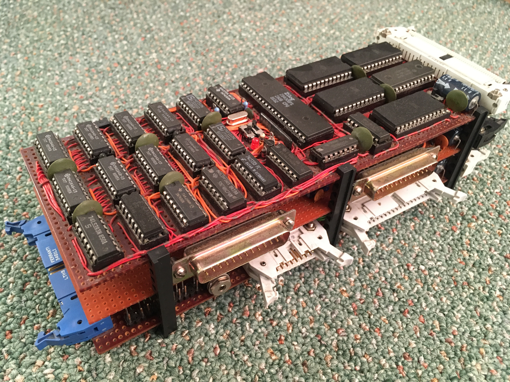
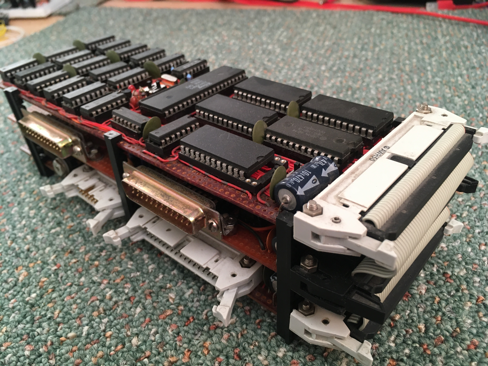

I started this project back in 1980's when the Z80 was cutting edge.  
Sad to say, I've only recently got the block of DRAM to work properly.

* Z80 @ 2MHz - will work at 4MHz, but running at 2MHz allows for connection to slower EEPROM devices.
* 64K DRAM - organised as 2 x 32K pages.
* 2K Static RAM (stack and system use).
* 3 x 2K EEPROM sockets (read only)
* 1 x 2K or 8K EEPROM socket (read/write)
* Switchable NMI and IRQ signals.
* 2 x RS-232 Serial ports.
* LED matrix display

